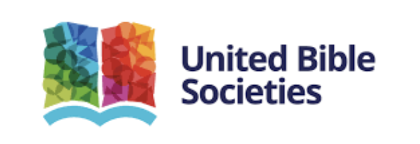
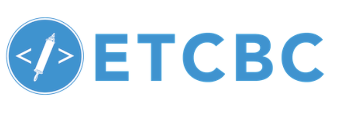
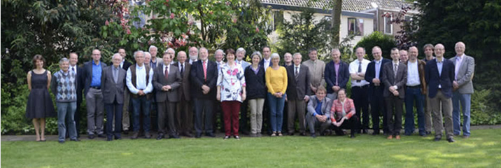

<html><body></body></html>

# Partners

We are very happy with the partners that collaborate to realize this project.

## {target=_blank}
Semantic Dictionary of Biblical Hebrew (SDBH) by the United Bible Societies
## {target=_blank}
Eep Talstra Centre for Bible and Computer (ETCBC)
## {target=_blank}
The Old Testament Society in the Netherlands and in Belgium (Het Oudtestamentisch Werkgezelschap in Nederland en België)