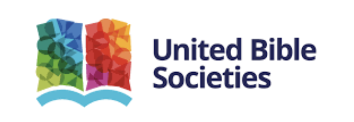
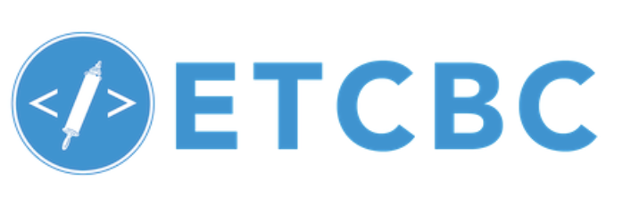
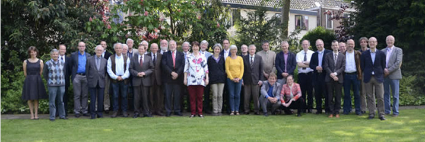

 

# Partners

We are very happy with the partners that collaborate to realize this project.

##  
Semantic Dictionary of Biblical Hebrew (SDBH) by the United Bible Societies
##  
Eep Talstra Centre for Bible and Computer (ETCBC)
##  
The Old Testament Society in the Netherlands and in Belgium (Het Oudtestamentisch Werkgezelschap in Nederland en België)